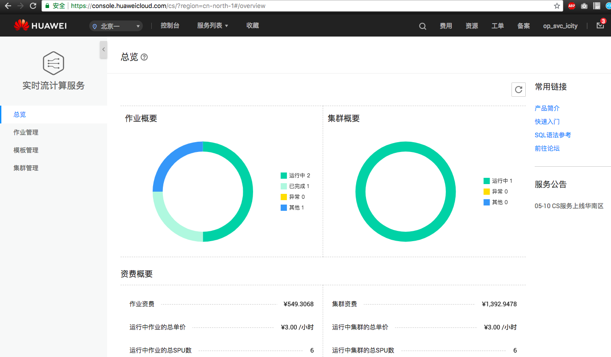
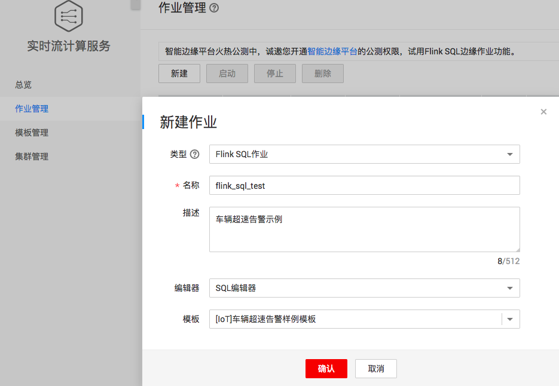
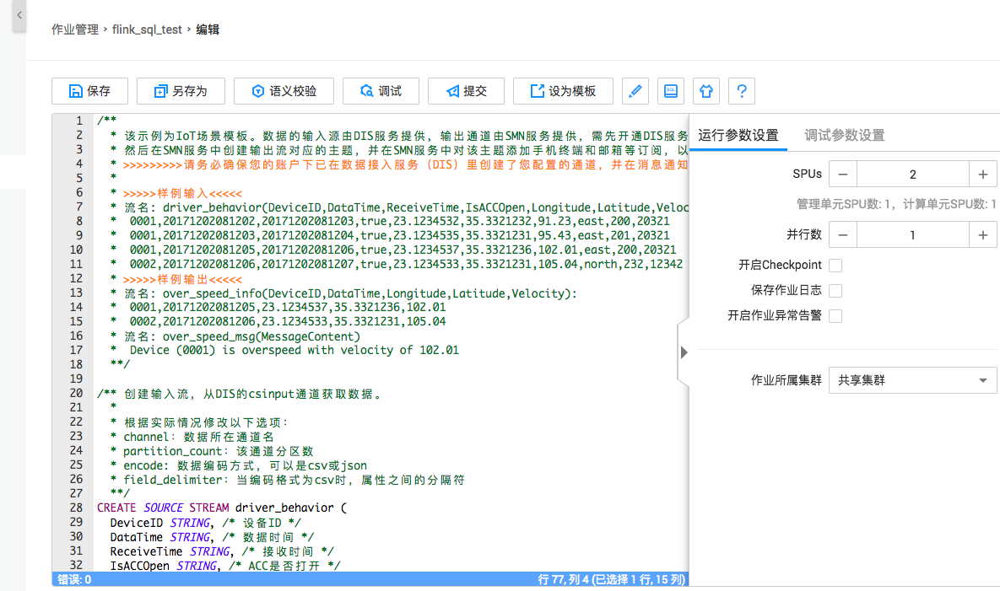
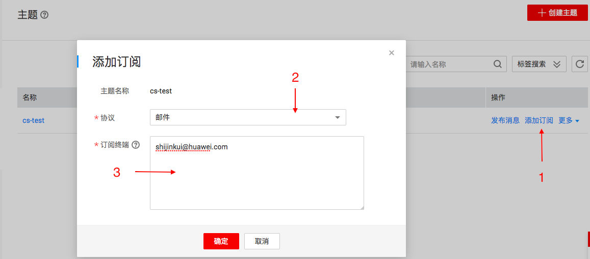
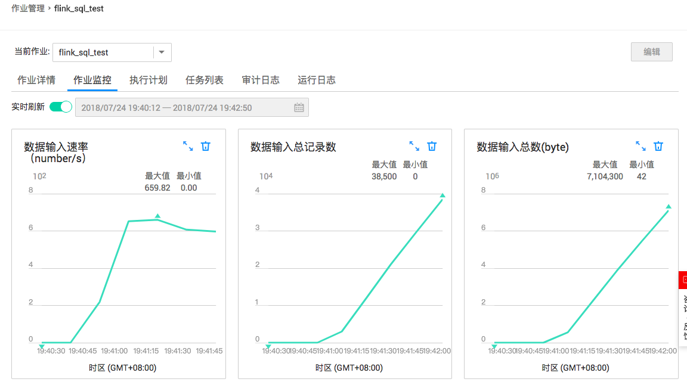

#  快速入门：车辆超速告警

[TOC]

##  任务介绍

在本示例中，从DIS数据源读数据，实时分析出超速车辆，向SMN输出源写数据。SMN一旦收到数据会向其订阅者发送短信或邮件。本示例中你会学习到：
- 创建并运行Flink SQL应用
- 完成“车辆超速告警”示例场景
- 完成车辆连续超速时，对用户实时邮件告警

本示例的github地址：[huaweicloud-cs-java-examples](https://github.com/huaweicloud/huaweicloud-cs-sdk/tree/master/huaweicloud-cs-java-examples)

> 实时流计算服务（Cloud Stream Service, 简称CS）提供实时处理流式大数据的全栈能力, 简单易用, 即时执行Stream SQL或自定义作业。无需关心计算集群, 无需学习编程技能。完全兼容Apache Flink和Spark API。详见[这里](https://www.huaweicloud.com/product/cs.html)

##  任务执行

###  第一步：创建Flink SQL作业

####  1. 进入CS控制台
- 直接进入 [**CS控制台**](https://console.huaweicloud.com/cs/?region=cn-north-1#/overview)
- [华为云官网](http://www.huaweicloud.com) -> 产品 -> [EI企业智能](https://www.huaweicloud.com/ei/) -> [实时流计算服务](https://www.huaweicloud.com/product/cs.html)，进入实时流计算的首页后，点击`立即使用`




####  2. 新建Flink SQL作业
`作业管理 -> 新建`：选择模版 `[IoT]车辆超速告警样例模板`


- 编辑器：Flink SQL作业支持**SQL编辑器**和**SQL可视化编辑器**，这里选择`SQL编辑器`
- 模版：目前提供了19个缺省模版，也支持用户自定义模版

点击“确认”，完成新建Flink SQL作业

####  3. SQL编辑器



**SQL编辑器中包含三部分内容：**

1. source数据源：在`with`语句中配置，这里选择的是DIS，就需要配置

   - type = "dis"     # 类型选择DIS
   - region = "cn-north-1"   # Region名称为当前所在的区域，名称见：[这里](https://developer.huaweicloud.com/endpoint?CS)
   - channel = "cs-test"      # 在DIS中新建的通道名称，**[新建DIS通道见这里](https://console.huaweicloud.com/dis/?region=cn-north-1#/manage/instanceList)**
   - partition_count = "1",   # 在DIS中通道的分区数
   - encode = "csv",            #  数据格式，CSV
   - field_delimiter = ","       #  行数据风格符，默认逗号分隔
2. sink输出源：
   - type = "smn"                # SMN为简单消息服务，步骤：1. [新建SMN通道](https://console.huaweicloud.com/smn/?region=cn-north-1#/smn/manager/topic)，得到URN（下面的topic_urn）和主题名（下面的message_subject）; 2. [添加订阅](https://console.huaweicloud.com/smn/?region=cn-north-1#/smn/manager/subscription)
   - region = "cn-north-1"   # 分区，默认华北区
   - topic_urn = "urn:smn:cn-north-1:ac538675aa074ff18d5f3224abeec213:cs-test"    # 见SMN中主题的URN列
   - message_subject = "cs-test"                      # SMN主题名
   - message_column = "MessageContent"     #  Sink中的哪一列作为消息体输出，这里选择的是`MessageContent`
3. SQL query：形如`SELECT DeviceID, MAX(Velocity) AS Velocity, COUNT(Velocity) AS overspeed_count `

####  4. 运行参数设置

在SQL编辑器的右侧，设置如下参数：

- SPU：Stream Processing Units 流处理单元，一个SPU为1核4G的资源，每SPU 0.5元/小时。最低2个SPU起。必选
- 并行数：Flink作业算子并行度，缺省为1。必选
- 开启checkpoint：是否开启Flink快照。非必选
- 保存作业日志：作业日志是否保存，会保存到您个人的OBS桶中。非必选
- 开启作业异常告警：作业异常后可推送SMN消息（邮件和短线）。非必选

###  第二步：创建DIS通道和SMN主题订阅

DIS数据摄入服务，其类似kafka的topic概念。SMN简单消息服务，用于短信或邮件通知。

####  1. 创建DIS通道

进入[DIS控制台](https://console.huaweicloud.com/dis/?region=cn-north-1#/manage/instanceList)，点击右侧`购买接入通道`，创建两个DIS通道：`cs-test`为数据源通道，`cs-test-output`为结果输出通道。


源数据类型选为`CSV`

####  2. 创建SMN主题

进入[SMN控制台  -> 主题管理](https://console.huaweicloud.com/smn/?region=cn-north-1#/smn/manager/dashboard)， 点击右侧`创建主题`


####  3. 添加邮件订阅



#### 4. 得到SMN URN和主题

进入：主题管理 -> 主题，鼠标放到`URN`列，会提示完整的URN，如`urn:smn:cn-north-1:ac538675aa074ff18d5f3224abeec211:cs-test`。
在第三步使用。

###  第三步：提交运行Flink SQL作业

进入：[CS控制台](https://console.huaweicloud.com/cs/?region=cn-north-1#/jobs/list) -> 作业管理  -> 选定已创建的作业，点击“编辑”

- 补充DIS信息和SMN信息。在`第二步`得到的DIS通道、SMN URN、SMN主题名
- 点击“提交”


###  第四步：发送DIS数据，测试结果

至此，实时流计算方面的工作完成了，下面就要接入数据，查看实时计算结果。

####  启动DIS Agent
这里使用DIS agent向云上DIS通道发送CSV结构的数据，DIS Agent是一个本地运行的代理，监控本地文件变化，一旦文件中有新的数据追加，即时把新增的数据发送到DIS通道中，类似flume。

DIS Agent使用方法：
1. [DIS Agent](https://support.huaweicloud.com/usermanual-dis/dis_01_0020.html)
2. [下载DIS Agent](https://dis-publish.obs-website.cn-north-1.myhwclouds.com/dis-agent-1.1.0.zip)
3. 本地解压
4. 修改`conf/agent.yml`
5. 启动`DIS Agent`: `bin/start-dis-agent.sh`

```yaml
---
# 不变。
region: cn-north-1
# user ak (get from 'My Credential')
ak: 填写你的AK
# user sk (get from 'My Credential')
sk: 填写你的SK
# user project id (get from 'My Credential')
projectId: 填写region所在的project id。进入console控制台->右上角 我的账号 选择"我的凭证"-> "项目列表中"选择"cn-north-1"对应的"项目ID"，类似"340a49ba009a489388216edxx245389e"
# 不变。
endpoint: https://dis.cn-north-1.myhwclouds.com:20004
# config each flow to monitor file.
flows:
  # DIS stream
  - DISStream: cs-test
    # only support specified directory, filename can use * to match some files. eg. * means match all file, test*.log means match test1.log or test-12.log and so on.
    filePattern: /Users/admin/h/dis-agent-1.0.4/data/*.log
    # from where to start: 'START_OF_FILE' or 'END_OF_FILE'
    initialPosition: START_OF_FILE
    # upload max interval(ms)
    maxBufferAgeMillis: 5000
```


####  发送DIS数据

本地用写个小程序，向文件中追加数据，这里使用的guava的files库。

```scala
import java.io.File
import com.google.common.base.Charsets
import com.google.common.io.Files

object DISTest {
  def main(args: Array[String]): Unit = {
    while (true) {
      val sample = Array(
        "0001,20171202081202,20171202081203,true,23.1234532,35.3321232,91.23,east,200,20321",
        "0001,20171202081203,20171202081204,true,23.1234535,35.3321231,95.43,east,201,20321",
        "0001,20171202081205,20171202081206,true,23.1234537,35.3321236,102.01,east,200,20321",
        "0002,20171202081206,20171202081207,true,23.1234533,35.3321231,105.04,north,232,12342"
      )

      val f = new File("/Users/admin/h/dis-agent-1.0.4/data/test.log")
      (0 until 300).foreach(i => {
        val line = sample(i % sample.length) + "\n"
        println(line)
        Files.append(line, f, Charsets.UTF_8)
        Thread.sleep(1)
      })
    }
  }
}
```

##  任务打卡

**1. 截图：超速邮件通知或短信 **


**2. 截图：运行时作业中流数据统计**



------------EOF--------------